# Gavin Stewart - Personal Portfolio 🚀

[](https://www.gdks.co.uk)
[](https://gdks.github.io)
[](https://opensource.org/licenses/MIT)

[](https://github.com/gdks/gdks.github.io/actions/workflows/ci-cd.yml)
[](https://github.com/gdks/gdks.github.io/actions/workflows/security-scan.yml)
[](https://github.com/gdks/gdks.github.io/actions/workflows/ci.yml)
[](https://github.com/gdks/gdks.github.io/actions/workflows/pr-checks.yml)

[](https://developer.mozilla.org/en-US/docs/Web/Guide/HTML/HTML5)
[](https://developer.mozilla.org/en-US/docs/Web/CSS)
[](https://developer.mozilla.org/en-US/docs/Web/JavaScript)

[](https://www.w3.org/WAI/)
[](https://developers.google.com/web/tools/lighthouse)
[](https://developers.google.com/search/docs)

> **A modern, responsive portfolio website showcasing 18+ years of software engineering excellence**

## 🌟 About

This is the personal portfolio website of **Gavin Stewart**, a Software Engineer and Engineering Leader based in Edinburgh, Scotland. The site showcases professional experience, technical skills, and innovative projects in the field of software engineering.

### 🎯 Key Features

- **🎨 Modern Design**: Clean, professional interface with smooth animations
- **📱 Fully Responsive**: Optimized for all devices and screen sizes
- **⚡ Performance Optimized**: Fast loading times and optimal user experience
- **🔍 SEO Friendly**: Structured data and meta tags for better search visibility
- **♿ Accessible**: WCAG compliant with comprehensive accessibility features
- **🔒 Secure**: Regular security scanning and best practices implementation

## 🚀 Live Demo

**🌐 Visit:** [www.gdks.co.uk](https://www.gdks.co.uk)

## 🛠️ Tech Stack

| Category        | Technologies                                 |
| --------------- | -------------------------------------------- |
| **Frontend**    | HTML5, CSS3, JavaScript (ES6+)               |
| **Styling**     | Custom CSS, Font Awesome Icons, Google Fonts |
| **Build Tools** | NPM, Prettier, HTMLHint, Stylelint, ESLint   |
| **Testing**     | Playwright, Lighthouse, axe-core, Pa11y      |
| **Deployment**  | GitHub Pages, GitHub Actions                 |
| **Security**    | Trivy, TruffleHog, Dependabot                |

## 📊 Quality Assurance

This project maintains high quality standards through comprehensive automated testing:

### 🔍 Code Quality

- **HTML Validation**: W3C HTML5 validator
- **CSS Linting**: Stylelint with standard configuration
- **JavaScript Linting**: ESLint with recommended rules
- **Code Formatting**: Prettier for consistent code style

### 🛡️ Security

- **Vulnerability Scanning**: Trivy security scanner
- **Secret Detection**: TruffleHog for hardcoded secrets
- **Dependency Scanning**: Automated security updates

### 🎯 Performance & Accessibility

- **Lighthouse Audits**: Performance, Accessibility, Best Practices, SEO
- **Cross-browser Testing**: Chrome, Firefox, Safari compatibility
- **Accessibility Testing**: axe-core and Pa11y validation
- **Responsive Design**: Multiple viewport testing

## 🚀 Getting Started

### Prerequisites

- Node.js 18+ (for development tools)
- Modern web browser
- Git

### Local Development

1. **Clone the repository**

   ```bash
   git clone https://github.com/gdks/gdks.github.io.git
   cd gdks.github.io
   ```

2. **Install development dependencies**

   ```bash
   npm install
   ```

3. **Start local server**

   ```bash
   # Using Python (recommended)
   python3 -m http.server 8000

   # Or using Node.js
   npx http-server -p 8000
   ```

4. **Open in browser**
   ```
   http://localhost:8000
   ```

## 🧪 Local CI Framework

This project includes a comprehensive local CI framework using Make that mirrors the GitHub Actions workflow. This allows you to run all CI checks locally before pushing code.

### Quick Start

```bash
# Install dependencies
make install

# Run quick CI checks (linting, formatting, HTML validation)
make ci

# Start local development server
make serve

# Run full CI suite (including accessibility, performance, and browser tests)
make ci-full
```

### Available Targets

#### Setup & Installation

- `make install` - Install all dependencies (dev + global tools)
- `make install-dev` - Install development dependencies only
- `make install-global` - Install global tools for CI (axe-core, pa11y, lighthouse, playwright)

#### Code Quality

- `make lint` - Run all linting checks (HTML, CSS, JavaScript)
- `make lint-html` - Lint HTML files with htmlhint
- `make lint-css` - Lint CSS files with stylelint
- `make lint-js` - Lint JavaScript files with ESLint
- `make format` - Format code with Prettier
- `make format-check` - Check code formatting without modifying files

#### Security

- `make security` - Run all security checks
- `make security-trivy` - Run Trivy vulnerability scanner
- `make security-secrets` - Check for hardcoded secrets with TruffleHog

#### Validation & Testing

- `make validate-html` - Validate HTML files with html5validator
- `make accessibility` - Run all accessibility tests (axe-core + pa11y)
- `make lighthouse` - Run Lighthouse performance and SEO tests
- `make test-browser` - Run cross-browser tests with Playwright

#### Development Server

- `make serve` - Start local development server on port 8000
- `make serve-stop` - Stop local development server

#### CI Targets

- `make ci` - Run quick CI checks (no server required)
- `make ci-quick` - Run quick CI checks (linting, formatting, HTML validation)
- `make ci-full` - Run full CI checks (includes accessibility, performance, browser tests)

#### Utility

- `make clean` - Clean up generated files and stop server
- `make check-deps` - Check if required tools are installed
- `make status` - Show current status (branch, node version, server status)

### Prerequisites for Full CI

These tools are optional and will be installed automatically when needed:

- **Trivy** - For vulnerability scanning

  ```bash
  # macOS
  brew install trivy

  # Ubuntu/Debian
  sudo apt-get install wget apt-transport-https gnupg lsb-release
  wget -qO - https://aquasecurity.github.io/trivy-repo/deb/public.key | sudo apt-key add -
  echo deb https://aquasecurity.github.io/trivy-repo/deb $(lsb_release -sc) main | sudo tee -a /etc/apt/sources.list.d/trivy.list
  sudo apt-get update
  sudo apt-get install trivy
  ```

- **TruffleHog** - For secrets detection

  ```bash
  # macOS
  brew install trufflesecurity/trufflehog/trufflehog

  # Or via pip
  pip install trufflehog
  ```

- **html5validator** - For HTML validation
  ```bash
  pip install html5validator
  ```

### Development Workflow

1. Start development server: `make serve`
2. Make changes to your code
3. Run quick checks: `make ci-quick`
4. If quick checks pass, run full suite: `make ci-full`
5. Commit and push when all checks pass

## 🔄 CI/CD Pipeline

The project uses a comprehensive GitHub Actions pipeline with automated quality gates, security scanning, and deployment processes.

### 🏗️ Pipeline Architecture

```mermaid
graph TB
    %% Event Triggers
    PR[Pull Request] --> CI[Continuous Integration]
    Push[Push to Feature Branch] --> CI
    Main[Push to Main] --> CD[Continuous Deployment]

    %% CI Pipeline Jobs
    CI --> CodeQuality[Code Quality Checks]
    CI --> SecurityScan[Security Scanning]
    CI --> HTMLValidation[HTML Validation]
    CI --> WebStandards[Web Standards & Accessibility]
    CI --> Lighthouse[Performance & SEO Testing]
    CI --> CrossBrowser[Cross-Browser Testing]

    %% Code Quality Details
    CodeQuality --> HTMLHint[HTML Linting]
    CodeQuality --> Stylelint[CSS Linting]
    CodeQuality --> ESLint[JavaScript Linting]
    CodeQuality --> Prettier[Code Formatting]

    %% Security Details
    SecurityScan --> Trivy[Trivy Vulnerability Scanner]
    SecurityScan --> TruffleHog[Secrets Detection]
    SecurityScan --> OWASP[OWASP ZAP Baseline]

    %% Web Standards Details
    WebStandards --> AxeCore[axe-core Testing]
    WebStandards --> Pa11y[Pa11y Accessibility]

    %% Performance Details
    Lighthouse --> Performance[Performance Score ≥80%]
    Lighthouse --> Accessibility[Accessibility Score ≥90%]
    Lighthouse --> BestPractices[Best Practices ≥80%]
    Lighthouse --> SEO[SEO Score ≥80%]

    %% Cross-Browser Details
    CrossBrowser --> Chrome[Chrome Testing]
    CrossBrowser --> Firefox[Firefox Testing]
    CrossBrowser --> Edge[Edge Testing]

    %% CD Pipeline
    CD --> Deploy[Deploy to GitHub Pages]
    Deploy --> Notify[Deployment Notifications]

    %% Local Development
    LocalDev[Local Development] --> MakeCI[Local CI via Makefile]
    MakeCI --> LocalTests[Local Testing Suite]

    %% Styling
    classDef ciJob fill:#e1f5fe,stroke:#01579b,stroke-width:2px
    classDef securityJob fill:#ffebee,stroke:#c62828,stroke-width:2px
    classDef qualityJob fill:#e8f5e8,stroke:#2e7d32,stroke-width:2px
    classDef deployJob fill:#fff3e0,stroke:#ef6c00,stroke-width:2px

    class CodeQuality,HTMLValidation,WebStandards,Lighthouse,CrossBrowser ciJob
    class SecurityScan,Trivy,TruffleHog,OWASP securityJob
    class HTMLHint,Stylelint,ESLint,Prettier,AxeCore,Pa11y,Performance,Accessibility,BestPractices,SEO qualityJob
    class Deploy,Notify deployJob
```



### 📋 Pipeline Workflows

#### 🔍 **Continuous Integration (`ci.yml`)**

**Triggers:** Pull Requests, Feature Branches, Main Branch

| Job                 | Purpose                           | Tools                                 | Thresholds                  |
| ------------------- | --------------------------------- | ------------------------------------- | --------------------------- |
| **Code Quality**    | Static analysis & formatting      | HTMLHint, Stylelint, ESLint, Prettier | Zero linting errors         |
| **Security Scan**   | Vulnerability & secrets detection | Trivy, TruffleHog                     | No critical vulnerabilities |
| **HTML Validation** | W3C HTML5 compliance              | html5validator                        | Zero validation errors      |
| **Web Standards**   | Accessibility testing             | axe-core, Pa11y                       | WCAG 2.1 AA compliance      |
| **Lighthouse**      | Performance & SEO audit           | Lighthouse CI                         | Performance ≥80%, A11Y ≥90% |
| **Cross-Browser**   | Browser compatibility             | Playwright                            | Chrome, Firefox, Edge       |

#### 🚀 **Continuous Deployment (`ci-cd.yml`)**

**Triggers:** Main Branch Pushes, Weekly Security Scans

- **Automated Deployment** to GitHub Pages
- **Artifact Management** for test reports
- **Deployment Notifications**

#### 🔒 **Security Scanning (`security-scan.yml`)**

**Triggers:** Daily scheduled scans, Manual dispatch

- **Daily Vulnerability Assessment** with Trivy
- **OWASP ZAP Baseline** security testing
- **Dependency Review** for security updates

### 🛠️ Local Development Pipeline

The project includes a comprehensive local CI framework using Make that mirrors the GitHub Actions workflow:

```bash
# Quick CI checks (no server required)
make ci-quick

# Full CI suite (includes accessibility, performance, browser tests)
make ci-full

# Individual checks
make lint          # All linting
make security      # Security scanning
make accessibility # Accessibility testing
make lighthouse    # Performance testing
```

### 📊 Quality Gates

| Category           | Tool             | Threshold     | Purpose                    |
| ------------------ | ---------------- | ------------- | -------------------------- |
| **Performance**    | Lighthouse       | ≥80%          | Core Web Vitals compliance |
| **Accessibility**  | axe-core + Pa11y | ≥90%          | WCAG 2.1 AA compliance     |
| **Best Practices** | Lighthouse       | ≥80%          | Modern web standards       |
| **SEO**            | Lighthouse       | ≥80%          | Search engine optimization |
| **Security**       | Trivy            | Zero critical | Vulnerability prevention   |
| **Code Quality**   | Linters          | Zero errors   | Maintainable codebase      |

### 🔄 Pipeline Flow

1. **Development** → Local testing with `make ci-full`
2. **Pull Request** → Automated CI checks in parallel
3. **Quality Gates** → All checks must pass
4. **Merge to Main** → Triggers deployment pipeline
5. **Deployment** → Automatic deployment to GitHub Pages
6. **Monitoring** → Continuous security and performance monitoring

## 📁 Project Structure

```
.
├── css/                    # Stylesheets
│   ├── main.css           # Main styles
│   └── normalize.css      # CSS reset
├── js/                    # JavaScript files
│   ├── main.js           # Main application logic
│   └── vendor/           # Third-party libraries
├── img/                   # Images and assets
├── .github/               # GitHub Actions workflows
│   └── workflows/
│       ├── ci-cd.yml     # Continuous deployment
│       ├── ci.yml        # Continuous integration
│       ├── pr-checks.yml # Pull request validation
│       └── security-scan.yml # Security scanning
├── index.html            # Main HTML file
├── 404.html              # Custom 404 page
├── robots.txt            # Search engine instructions
├── site.webmanifest      # PWA manifest
├── Makefile              # Local CI framework
└── README.md             # This file
```

## 🔧 Configuration Files

- **`.prettierrc`**: Code formatting configuration
- **`.htmlhintrc`**: HTML linting rules
- **`.gitignore`**: Git ignore patterns
- **`browserconfig.xml`**: Browser configuration
- **`CNAME`**: Custom domain configuration

## 🌐 Deployment

The site is automatically deployed to GitHub Pages using GitHub Actions:

1. **Continuous Integration**: All code changes trigger comprehensive testing
2. **Quality Gates**: Deployment only occurs after passing all quality checks
3. **Security Scanning**: Regular vulnerability assessments
4. **Performance Monitoring**: Lighthouse audits on every deployment

## 🤝 Contributing

While this is a personal portfolio, suggestions and feedback are welcome!

1. Fork the repository
2. Create a feature branch (`git checkout -b feature/amazing-feature`)
3. Commit your changes (`git commit -m 'Add amazing feature'`)
4. Push to the branch (`git push origin feature/amazing-feature`)
5. Open a Pull Request

## 📄 License

This project is licensed under the MIT License - see the [LICENSE.txt](LICENSE.txt) file for details.

## 📞 Connect

- **🌐 Website**: [www.gdks.co.uk](https://www.gdks.co.uk)
- **💼 LinkedIn**: [linkedin.com/in/gavinstewart](https://www.linkedin.com/in/gavinstewart)
- **👨‍💻 GitHub**: [github.com/gdks](https://github.com/gdks)

## 🙏 Acknowledgments

- Built with HTML5 Boilerplate
- Icons by Font Awesome
- Typography by Google Fonts

<div align="center">
  <strong>⚡ Crafted with passion in Edinburgh, Scotland 🏴󠁧󠁢󠁳󠁣��󠁿</strong>
</div>
